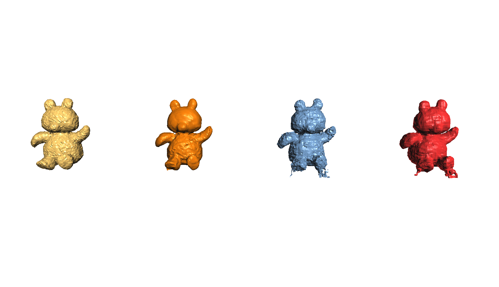

# Learning 3D SDF using approaches inspired from MLP, NeRF, SIREN
by Nail Ibrahimli


# Hyperparameters

Creating SDF data width of W, height of H and radius of R


```python
W = 64  #width
H = 64  #height
D = 64  #depth
R = 16  #radius
iso_val = 0.0 #surface level
space_sampling = 0.01 # SDF sampling
number_of_points = 1000000 #SDF num points

# Might needed to be tuned per model
Hidden = 64  # hidden layer size for the models
epoch = 20000  # epoch counts
Harmonics = 32  # for postional encoding
LR = 0.01  # learning rate
SAMPLING = 1  # sampling ratio
print_rate = 5000  # printing rate # epochs
criterion = torch.nn.HuberLoss() #loss function
```
 


# Naive MLP
Let's regress and memorize it with Naive MLP


```python
class Feedforward(torch.nn.Module):
    def __init__(self, input_size, hidden_size, higher_dimension=4, ):
        super().__init__()
        self.input_size = input_size
        self.hidden_size = hidden_size
        self.higher_dimension = higher_dimension
        self.Softplus = torch.nn.Softplus(beta=10)
        if (higher_dimension):  # for fairness
            self.fc0 = torch.nn.Linear(self.input_size, higher_dimension * input_size * 2)
            self.fc1 = torch.nn.Linear(self.higher_dimension * input_size * 2, self.hidden_size)
        else:
            self.fc1 = torch.nn.Linear(self.input_size, self.hidden_size)
        self.fc2 = torch.nn.Linear(self.hidden_size, self.hidden_size)
        self.fc3 = torch.nn.Linear(self.hidden_size, self.hidden_size)
        self.fc4 = torch.nn.Linear(self.hidden_size, self.hidden_size)
        self.fc5 = torch.nn.Linear(self.hidden_size, self.hidden_size)
        self.fc6 = torch.nn.Linear(self.hidden_size, self.hidden_size)
        self.fc7 = torch.nn.Linear(self.hidden_size, self.hidden_size)
        self.fc8 = torch.nn.Linear(self.hidden_size, 1)

    def forward(self, x):
        if (self.higher_dimension):  # for fairness
            hidden = self.fc1(self.Softplus(self.fc0(x)))
        else:
            hidden = self.fc1(x)
        softplus = self.Softplus(hidden)
        softplus2 = self.Softplus(self.fc2(softplus))
        softplus3 = self.Softplus(self.fc3(softplus2))
        output = self.fc8(softplus3)
        return output
```
# Harmonical embedding
I think it is better to think about it as a harmonical embedding than Positional Encoding,


```python
class HarmonicEmbedding(torch.nn.Module):
    def __init__(self, n_harmonic_functions=3, omega0=0.1):
        """
        I took some ideas from PyTorch3D implementation for implementing this
        """
        super().__init__()
        self.register_buffer(
            'frequencies',
            omega0 * (2.0 ** torch.arange(n_harmonic_functions)),
        )
    def forward(self, x):
        """
        Args:
            x: tensor of shape [..., dim]
        Returns:
            embedding: a harmonic embedding of `x`
                of shape [..., n_harmonic_functions * dim * 2]
        """
        embed = (x[..., None] * self.frequencies).view(*x.shape[:-1], -1)
        return torch.cat((embed.sin(), embed.cos()), dim=-1)
```

# Naive NeRF
Let's regress and memorize it with Naive NeRF


```python
class FeedforwardNeRF(torch.nn.Module):
    # For 3D SDF regression, with out any Radiance Fields of course
    def __init__(self, n_harmonic_functions, input_size, hidden_size):
        super().__init__()
        self.harmonic_embedding = HarmonicEmbedding(n_harmonic_functions)
        self.input_size = n_harmonic_functions * input_size * 2
        self.hidden_size = hidden_size
        self.Softplus = torch.nn.Softplus(beta=10)
        self.fc1 = torch.nn.Linear(self.input_size, self.hidden_size)
        self.fc2 = torch.nn.Linear(self.hidden_size, self.hidden_size)
        self.fc3 = torch.nn.Linear(self.hidden_size, self.hidden_size)
        self.fc4 = torch.nn.Linear(self.hidden_size, self.hidden_size)
        self.fc5 = torch.nn.Linear(self.hidden_size, self.hidden_size)
        self.fc6 = torch.nn.Linear(self.hidden_size, self.hidden_size)
        self.fc7 = torch.nn.Linear(self.hidden_size, self.hidden_size)
        self.fc8 = torch.nn.Linear(self.hidden_size, 1)

    def forward(self, x):
        x = self.harmonic_embedding(x)
        hidden = self.fc1(x)
        softplus = self.Softplus(hidden)
        softplus2 = self.Softplus(self.fc2(softplus))
        softplus3 = self.Softplus(self.fc3(softplus2))
        output = self.fc8(softplus3)

        return output
```

# Naive SIREN
Let's regress and memorize it with Naive SIREN


```python
class FeedforwardSIREN(torch.nn.Module):
    def __init__(self, n_harmonic_functions, input_size, hidden_size):
        super().__init__()
        self.harmonic_embedding = HarmonicEmbedding(n_harmonic_functions)
        self.input_size = n_harmonic_functions * input_size * 2
        self.hidden_size = hidden_size
        self.Softplus = torch.nn.Softplus(beta=10)
        self.fc1 = torch.nn.Linear(self.input_size, self.hidden_size)
        self.fc2 = torch.nn.Linear(self.hidden_size, self.hidden_size)
        self.fc3 = torch.nn.Linear(self.hidden_size, self.hidden_size)
        self.fc4 = torch.nn.Linear(self.hidden_size, self.hidden_size)
        self.fc5 = torch.nn.Linear(self.hidden_size, self.hidden_size)
        self.fc6 = torch.nn.Linear(self.hidden_size, self.hidden_size)
        self.fc7 = torch.nn.Linear(self.hidden_size, self.hidden_size)
        self.fc8 = torch.nn.Linear(self.hidden_size, 1)

    def forward(self, x):
        x = self.harmonic_embedding(x)
        hidden = self.fc1(x)

        softplus_siren = torch.sin(hidden)
        softplus2_siren = torch.sin(self.fc2(softplus_siren))
        softplus3_siren = torch.sin(self.fc3(softplus2_siren))
        output = self.fc8(softplus3_siren)

        return output

```

    
# Train and generate obj on cuda

```python   
model = Feedforward(3, Hidden, Harmonics).cuda()
optimizer = torch.optim.Adam(model.parameters(), lr=LR) #optimizer
model = train(model.cuda(), X_train.cuda(), y_train.cuda(), epoch, optimizer, criterion, print_rate, D, H, W )
SDF_estimated = fillSDF(model(X_train.cuda()),D,H,W)
v, t, n, val = visualize(SDF)
writeOBJ("SDF_estimated.obj",v,t)
```    

# Train and generate obj on cpu

```python   
model = Feedforward(3, Hidden, Harmonics)
optimizer = torch.optim.Adam(model.parameters(), lr=LR) #optimizer
model = train(model, X_train, y_train, epoch, optimizer, criterion, print_rate, D, H, W )
SDF_estimated = fillSDF(model(X_train),D,H,W)
v, t, n, val = visualize(SDF)
writeOBJ("SDF_estimated.obj",v,t)
```    

# Results with default settings


Gold -> calculated mesh from GT data <br>
Orange -> calculated mesh from MLP SDF <br>
Blue -> calculated mesh from NeRF SDF <br>
Red -> calculated mesh from SIREN SDF <br>